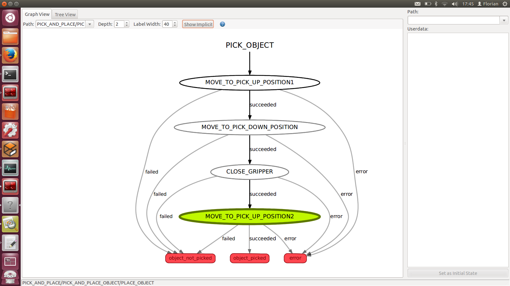
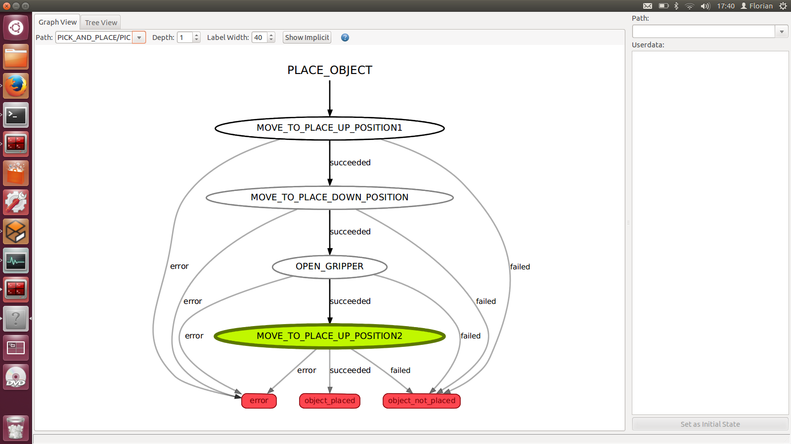
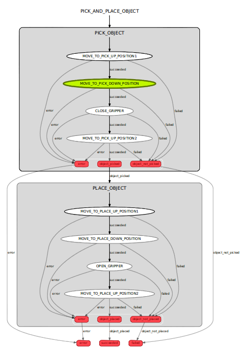
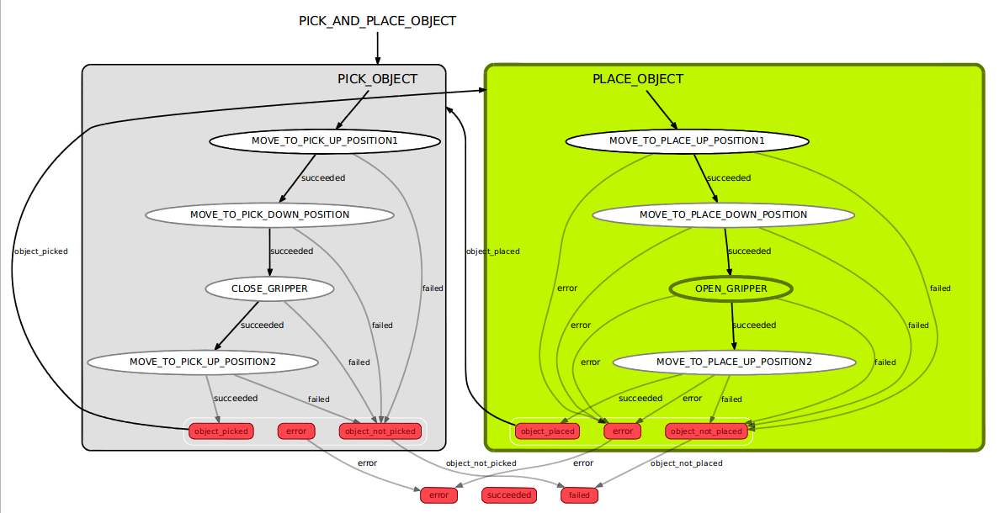

<a id="top"/> 
# Application development with ROS
## Tutorial

### Contents

1. <a href="#1--introduction">Introduction</a>
2. <a href="#2-Running-a-pick-and-place-application-with-SMACH">Running a pick and place application</a>
3. <a href="#3-run-the-pick-an-place-application-continuously">Run the pick and place application continuously</a>
4. <a href="#4-transfer-the-application-to-other-robots">Transfer the application to other robots</a>
5. <a href="#5-create-a-new-application-new-state-machine">Create a new application (new state machine)</a>

### 1. Introduction
This section quickly introduces basic tools used within this tutorial. It also lists several helpful (terminal) commands that are used frequently throughout this tutorial.

#### Useful terminal commands
You can find a list of useful tools and terminal commands in the [ROS Cheat Sheet](http://download.ros.org/downloads/ROScheatsheet.pdf "ROS Cheat Sheet").

#### SMACH
SMACH is a finite state machine programming approach in ROS. It is based on python and allows to define states as basic building blocks as well as run them in various containers and compose them to state machines. State machines can on the other hand consist of sub-state machines again. You can find more information about SMACH at the [SMACH wiki page](http://wiki.ros.org/smach).

#### Exporting ROS_MASTER_URI
The `ROS_MASTER_URI` can be used to connect to different ROS cores. In this tutorial we'll use several robots (partly real, partly in simulation). To connect to the correct robot to run your applications you will have to export an environment variable called `ROS_MASTER_URI`. Here's a list of the robots we're using and their corresponding `HOSTNAME`.
* Universal Robot UR10 (real):  `robot-ur`
* Kuka LBR (sim):               `robot-lbr`
* Schunk LWA4d (sim):           `robot-lwa4d`

You can export the `ROS_MASTER_URI` with
```
export ROS_MASTER_URI=http://<<HOSTNAME>>:11311
```

So for the simulated Kuka LBR this would be
```
export ROS_MASTER_URI=http://robot-lbr:11311
```

#### Make sure your code is up-to-date
```
roscd ipa_seminar
git pull origin master
```

<a href="#top">top</a>

### 2. Running a pick and place application with SMACH  
**Task**: Run a pick and place application for the universal robot arm.

**Goal**: Learn how to start and monitor a SMACH application.

We have already prepared a pick and place application which moves an object from `area_1` to `area_2`.

#### Start the application
We'll start with the real robot which is running on `http://robot-lbr:11311`. To start the application:
```
export ROS_MASTER_URI=http://robot-ur:11311
roslaunch ipa_seminar_application_pick_and_place pick_and_place.launch
```

#### Monitor execution
There's a graphical tool which visualizes the states and transitions. The current state or sub-state machine is highlighted. While the pick and place application is running you can monitor its state. Start the tool with
```
rosrun smach_viewer smach_viewer.py
```

#### Coding details
The image shows the atomic building blocks (basic states and sub-state machines) which can be used for our application.

Basic states:
* `prepare_robot()`             Brings the robot into a defined starting position
* `move_planned(pose)`          Moves to a given pose avoiding collisions
* `move_lin(pose)`              Moves to a given pose on a straight line avoiding collisions
* `open_gripper()`              Opens the gripper
* `close_gripper()`             Closes the gripper

Sub-state machines:
* `pick_object(area)`           Picks up an object from a given target area (uses move_planned, move_lin and close_gripper)
* `place_object(area)`          Places an object on a given target area (uses move_planned, move_lin and open_gripper)

The following screenshots show the composition of the `pick_object` and the `place_object` state machines out of the given basic states:

|`pick_object`|`place_object`|
|:-----------:|:------------:|
|||

The source code for the states and application above is distributed over four files inside the `ipa_seminar_application_pick_and_place` package. Each file represents one aspect of the **separation of concerns**:
* `src/pick_and_place_states.py`:   Defines basic states (= building blocks for our application)
* `src/pick_and_place.py`:          Defines the pick and place application (= coordination for our application)
* `config/application_config.yaml`:    Defines the target areas (= configuration for our application)
* `launch/pick_and_place.launch`:      Defines which components need to be started (= deployment of our application)

You can navigate to the package and open the files e.g. with
```
roscd ipa_seminar_application_pick_and_place
gedit config/application_config.yaml
```

<a href="#top">top</a>

### 3. Run the pick an place application continuously
**Task**: Modify the application in a way that it runs continuously.

**Goal**: Learn how to modify state transitions.

#### Modify the application code
We will have to modify the state machine which coordinates the pick and place application. At the moment the state machine looks like this:



Now we want to have a continuously running pick and place application which should look like this:



You can open the pick and place application file with
```
roscd ipa_seminar_application_pick_and_place
gedit src/pick_and_place.py
```
In the file you'll find the `pick_and_place_object` class which defines a SMACH state machine out of two sub-state machines `pick_object` and `place_object`. 
```
class pick_and_place_object(smach.StateMachine):
	def __init__(self, source_area, target_area):	
		smach.StateMachine.__init__(self, 
			outcomes=['succeeded', 'failed', 'error'])

		with self:
			smach.StateMachine.add('PICK_OBJECT', pick_object(source_area),
				transitions={'object_picked':'PLACE_OBJECT', 
							'object_not_picked':'failed',	
							'error':'error'})

			smach.StateMachine.add('PLACE_OBJECT', place_object(target_area),
				transitions={'object_placed':'succeeded',
							'object_not_placed':'failed',
							'error':'error'})

```
Each state has a name, a type and a list of transitions which connect the outcome of a state to the next state. Our state machine itself has a list of three outcomes ```outcomes=['succeeded', 'failed', 'error']```. All transitions inside the state machine should either point to another state inside the same state machine or point to an outcome of the state machine. If we connect the `object_placed` outcome of the `PLACE_OBJECT` state to `PICK_OBJECT` we will continuously pick and place an object from the `source_area` to the `target_area`. Please modify the `PLACE_OBJECT` state like this:
```
smach.StateMachine.add('PLACE_OBJECT', place_object(target_area),
	transitions={'object_placed':'PICK_OBJECT',
				'object_not_placed':'failed',
				'error':'error'})
```

Save the file and start the application with your modifications again with
```
roslaunch ipa_seminar_application_pick_and_place pick_and_place.launch
```

#### Change the target areas
If you want to change the target and source areas where the objects will be picked and placed you can do that by just changing the names for the predefined areas in the `main()` function of the application:

From `area_1` e.g. to `area_3` and from `area_2` e.g. to `area_4`.

Save the file and start the application with your modifications again with
```
roslaunch ipa_seminar_application_pick_and_place pick_and_place.launch
```

If you want to change the predefined areas or add new areas, you can do that in the file `application_config.yaml`:
```
roscd ipa_seminar_application_pick_and_place
gedit config/application_config.yaml
```

The reference coordinate system is shown in RVIZ. Keep it mind that the areas need to be in the workspace of the arm, otherwise the application cannot be executed and will abort with a failure. 

Save the file and start the application with your modifications again with
```
roslaunch ipa_seminar_application_pick_and_place pick_and_place.launch
```

<a href="#top">top</a>

### 4. Transfer the application to other robots
**Task**: Run the same application on various robots.

**Goal**: Learn how to design an application to be hardware independent.

#### Run your applications on another robot
By changing the `ROS_MASTER_URI` you can run your application on a different robot setup. E.g. you can run your application on the simulated Kuka LBR with
```
export ROS_MASTER_URI=http://robot-lbr:11311
roslaunch ipa_seminar_application_pick_and_place pick_and_place.launch
```

#### Thinks to keep in mind while developing hardware independent applications
Based on the standardizes ROS API to the driver layer and the higher level capabilities (e.g. motion planning) it is possible to define an application which is hardware independent. This is a (not complete) list which need to be taken into account while developing an hardware independent application:
* Do not use hardcoded joint space positions or trajectories. Use cartesian poses or semantic names to describe your application.
* Separation of concerns.
* Separation of roles.
* Robots need to have similar workspaces or at least cover the target areas.

<a href="#top">top</a>

### 5. Create a new application (new state machine)
**Task**: Define a new application to switch two objects.

**Goal**: Learn how to define new state machines composed out of already existing sub-state machines.

The task is to define a new application which is able to switch the place of two objects. We have the following situation:

|Area1 |Area2 |
|:------:|:-----:|
|A |B |

Now we want to change the places of object A and B to get

|Area1 |Area2 |
|:------:|:-----:|
|B |A |

#### Approach
To solve this, we'll have to implement the following sequence:

|	|Area1	|Area2	|Area3	|
|------	|:-----:|:-----:|:-----:|
|Start	|A	|B	|-	|
|Step1	|A	|-	|B	|
|Step2	|-	|A	|B	|
|Step3	|B	|A	|-	|

All we need is a state which offers the capability to move one object from a source area to a target area. The `pick_and_place_object` state will do that for us.

#### Compose the new sub-state machine
Let's define a sub-state machine `pick_and_place_object(source_area, target_area)` out of the previous application which takes a `source_area` and a `target_area` as input parameters. If we do that four times in the order listed above we get a new application called `switch_object`. Copy the following lines to the `switch.py` template file. You can open the file with
```
roscd ipa_seminar_application_pick_and_place/src
gedit switch.py
```
```
            smach.StateMachine.add('A_TO_BUFFER', pick_and_place_object(area_a, buffer_area),
                transitions={'succeeded':'B_TO_A', 
                    'failed':'failed',
                    'error':'error'})

            smach.StateMachine.add('B_TO_A', pick_and_place_object(area_b, area_a),
                transitions={'succeeded':'BUFFER_TO_B',
                'failed':'failed',
                'error':'error'})

            smach.StateMachine.add('BUFFER_TO_B', pick_and_place_object(buffer_area, area_b),
                transitions={'succeeded':'succeeded',
                    'failed':'failed',
                    'error':'error'})
```
**Remarks:**
* **Remember to undo your changes from step 3 in `pick_and_place.py`** because we don't want to have a continuous pick and place here.
* **Python is very sensitive with tabs and spaces**, if you get an error when starting the application, check the indentation.

Save the file and start the application with your modifications with
```
roslaunch ipa_seminar_application_pick_and_place switch.launch
```

#### Extend the application to sort a whole sequence of objects (optional)
Based on the `switch_objects` state you can build up an application to sort a sequence of objects. E.g.

|	|Area1	|Area2	|Area3	|Area4	|Area5	|
|------	|:-----:|:-----:|:-----:|:-----:|:-----:|
|Start	|D	|B	|A	|C	|-	|
|Goal	|A	|B	|C	|D	|-	|
