# ROS driver programming using BRIDE
## Tutorial

The goal of this tutorial is to create a ROS driver for the KUKA KR16 robot using the BRIDE tool-chain for model-driven engineering. Basic information and details about Bride are available [here](http://wiki.ros.org/bride). The tutorial begins with a short introduction on how to setup the BRIDE IDE and moves on to the creation of two node models: One node model which is wrapping the kr16 robot driver and another node which will trigger the kr16 driver to continuously move the robot from one waypoint to another.

### 1.  Startup BRIDE and create a new project

#### 1.1.  Installing BRIDE

For installing BRIDE please follow the [BRIDE installation instructions](https://github.com/ipa320/bride/wiki/Installation).

#### 1.2.  Running the BRIDE IDE
You can startup bride from your terminal by calling
```
rosrun bride eclipse
```
After the start of BRIDE you will be asked for a workspace directory. Choose the /src directory that lies in your [catkin](http://wiki.ros.org/catkin) workspace e.g. /home/ros/catkin_ws/src.

When you close the welcome page, you should now see the eclipse IDE on your desktop.

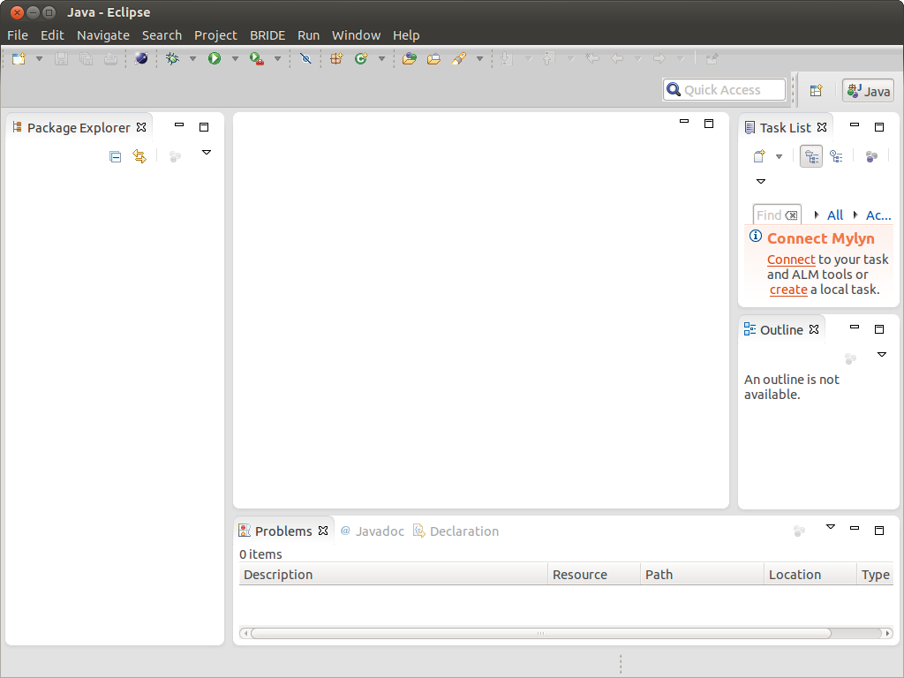

#### 1.2.  Creating a new BRIDE project

You can now create a new project by choosing the wizard in File -> New -> Project and then choose C/C++ -> C++ Project. Hit the "Next>" button to continue.

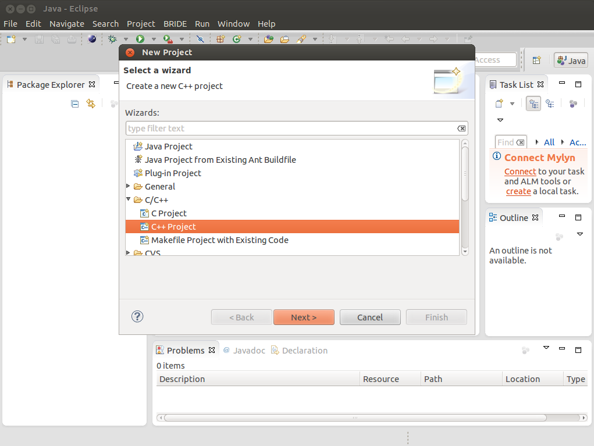

In the wizard give the new project the name of the package you want to create and choose as project type "Makefile project" -> "Empty Project". In the case of the tutorial we want to create the package "kr16_driver". 

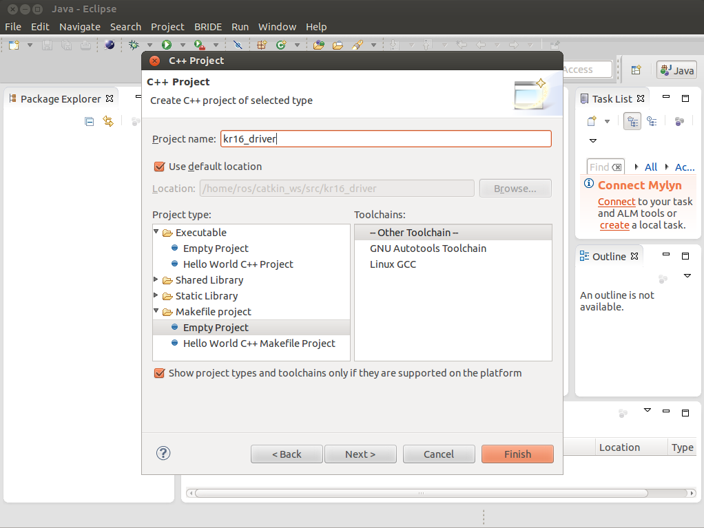

Finish the wizard by hitting the "Finish" button and accept the opening of the C/C++ perspective when being asked
 
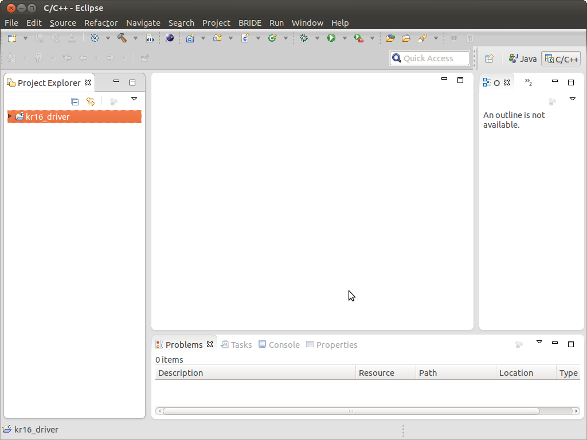

### 2.  Creating the driver model

Create a new folder in the kr16_driver project called "model" by right clicking on the project in the project explorer on the left and choose New -> Folder.

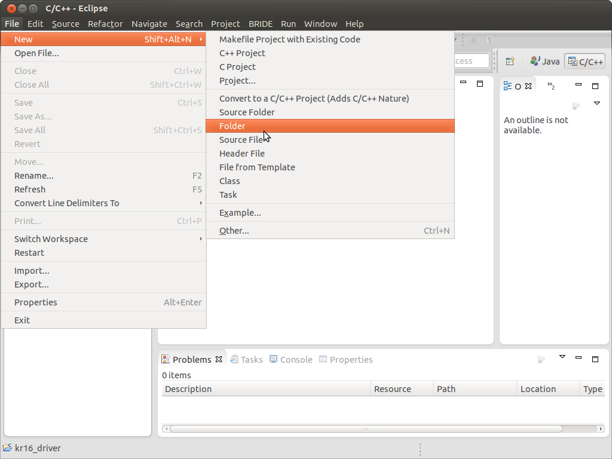
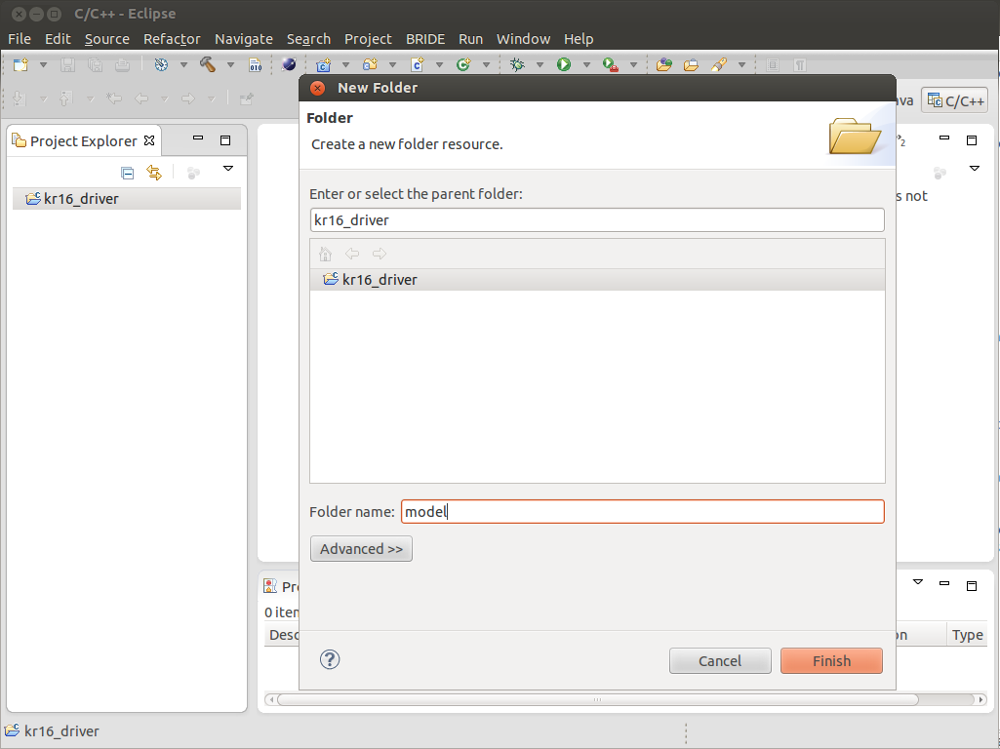

Now create a new capability model by right clicking on the new folder and choosing New -> Other... and then "ROS Package Diagram" in the BRIDE section. Follow the wizard by giving the RosPackage Diagram the name of the node. In the case of this tutorial "kr16_driver.ros_package_diagram". 

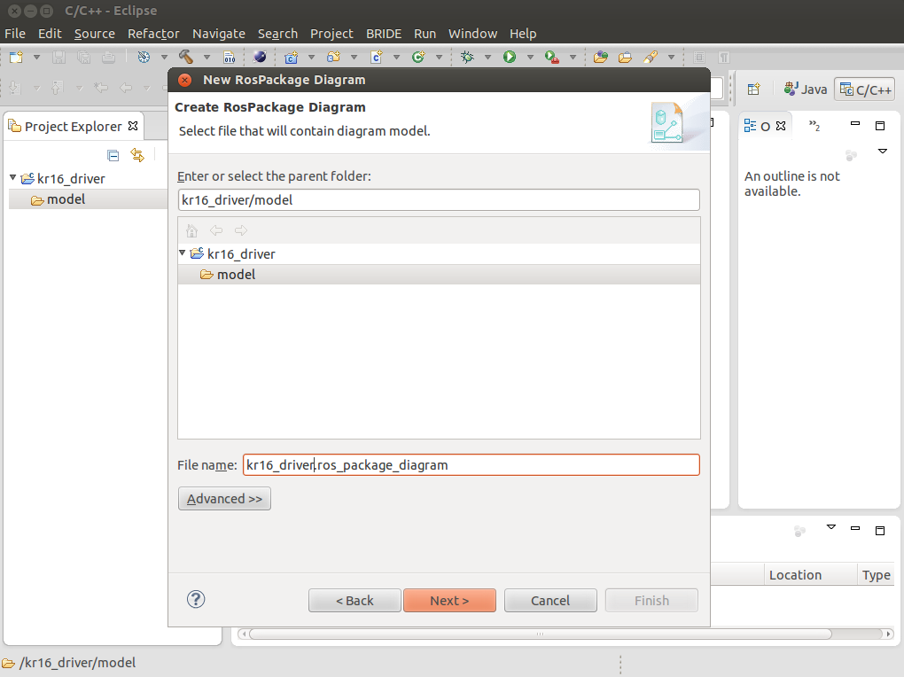

Then on the next page make sure the name of the model is also the name of the node. In this tutorial it should be kr16_driver.ros_package. 

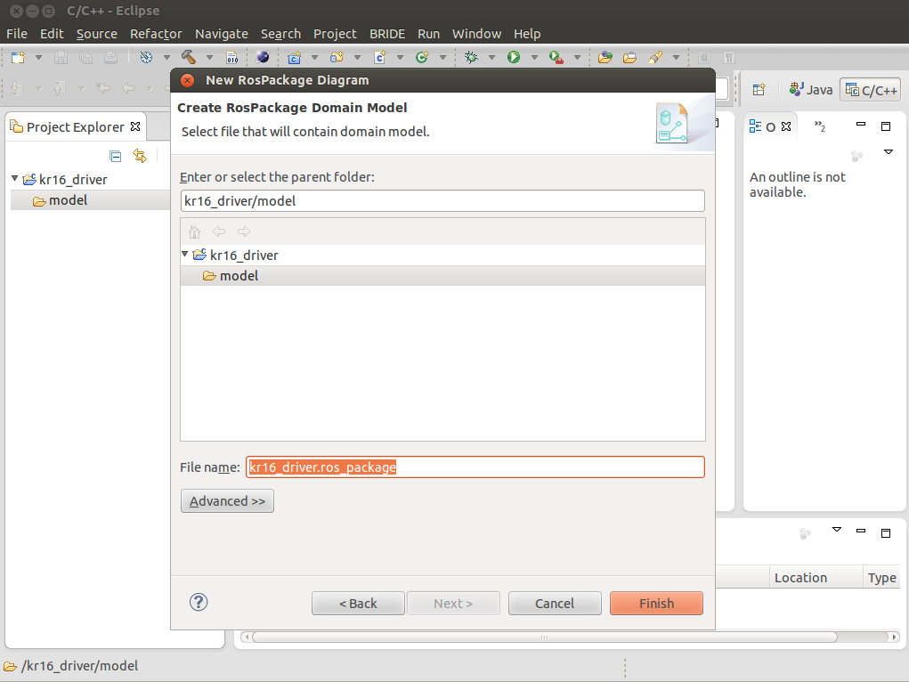

Now you can finish the wizard.

You now should have 2 new files inside the model directory and the graphical editor for your new model should be opened. Choose the "Capability Developer" perspective by hitting the "Open Perspective" button in the upper right corner of the eclipse IDE.

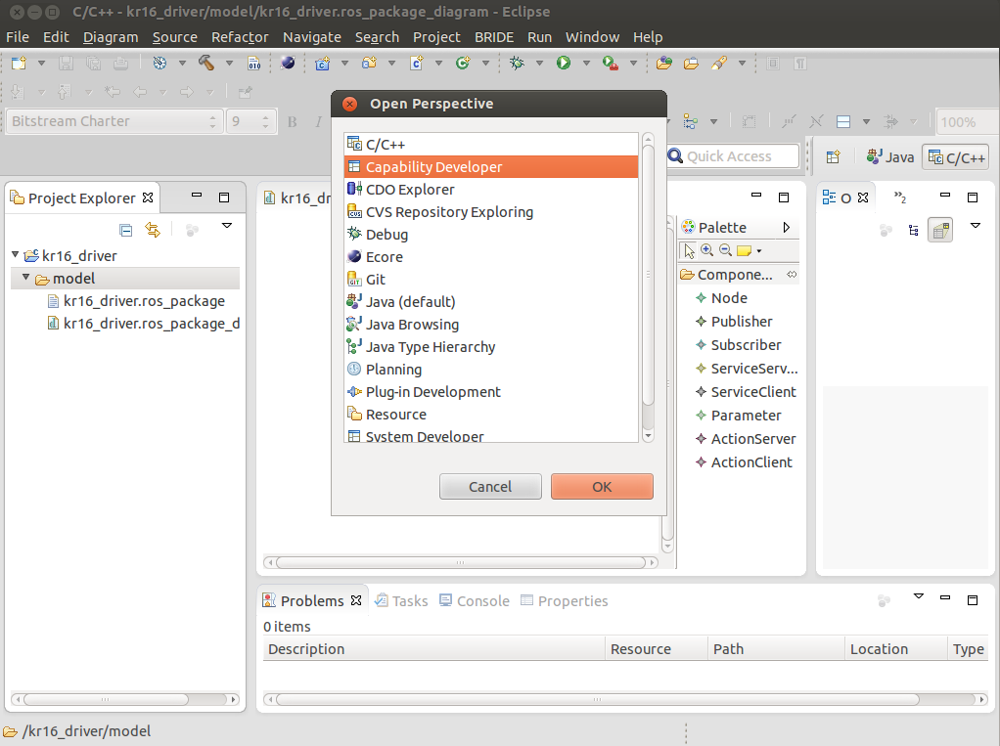

With the palette on the right you can now add a "Node" to the graphical plane by selecting "Node" and drawing a rectangle. Name the node "kr16_driver".

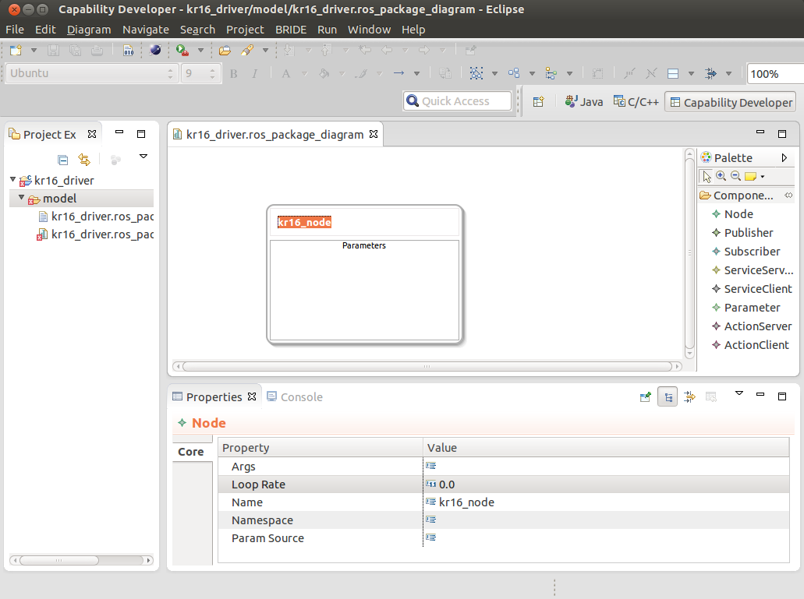

Following the [ROS-I driver specs](http://wiki.ros.org/Industrial/Industrial_Robot_Driver_Spec), add a Publisher called "joint_states" and "states" and an ActionServer called "folllow_joint_trajectory_action" by selecting the corresponding type on the right pane and clicking on the corner of the graphical node representation. You should then see the following screen: 

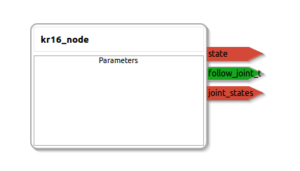

Now we have to do a few setting for the package and the nodes. Select the properties pane in the lower area of the screen. When you click in the white area of the screen you should see the package properties below. Fill them out as in the screenshot below: 

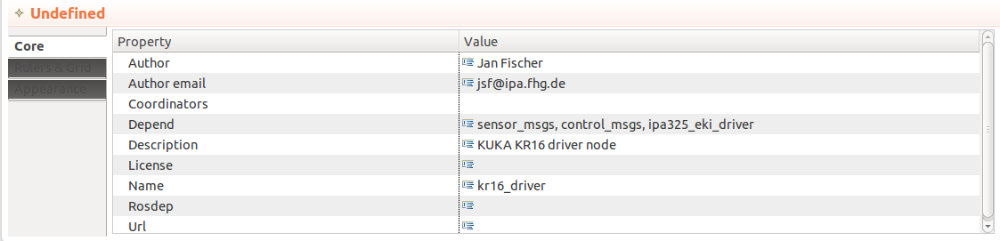

Now select the other components you created in order to show their settings in the property pane. Fill out the settings as in the following screens: 

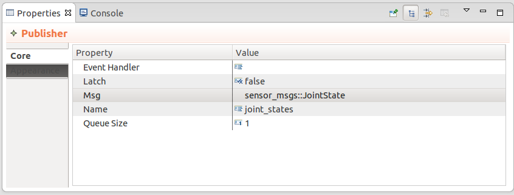
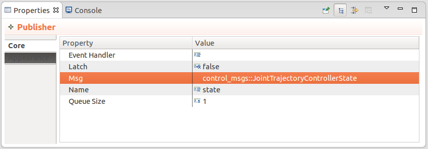
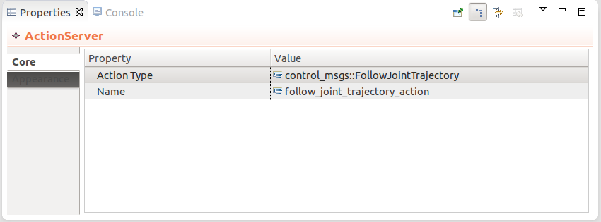

Follwoing the [ROS-I driver specs](http://wiki.ros.org/Industrial/Industrial_Robot_Driver_Spec), we now add the following parameters to the node model: robot_ip_address (ip address of the robot), robot_description (urdf description parameter) and robot_port (the port the robot is listening to. Not defined in the spec.). Your model should then look as follows

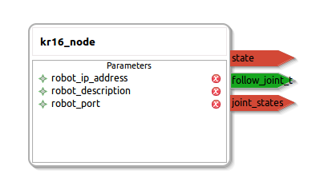

Again, we have to set the properties for the node paramteres, by selecting each of them and entering the following information:

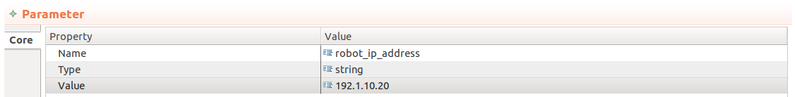
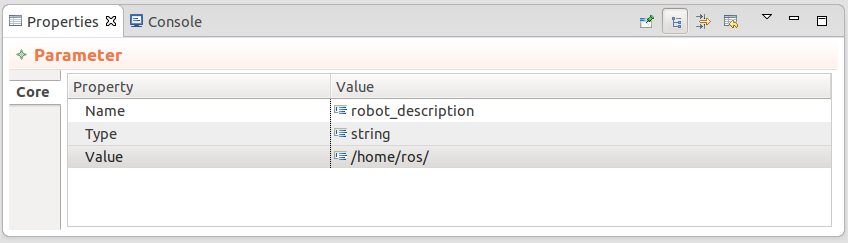
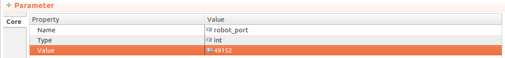

Finally, our driver model is now complete. Congratulations! (but don't forget to save your model)


### 3.  Generating source code from the model

You can now generate the source code of the node automatically based on the model you created. This is done by selecting BRIDE -> ROS -> "Generate C++ Code" from the menu. Be sure you saved your diagram before generating. When you refresh your project in the project explorer by right-clicking on the project and selecting "Refresh". You should now see the complete ROS package structure in the project explorer as in the screenshot below: 

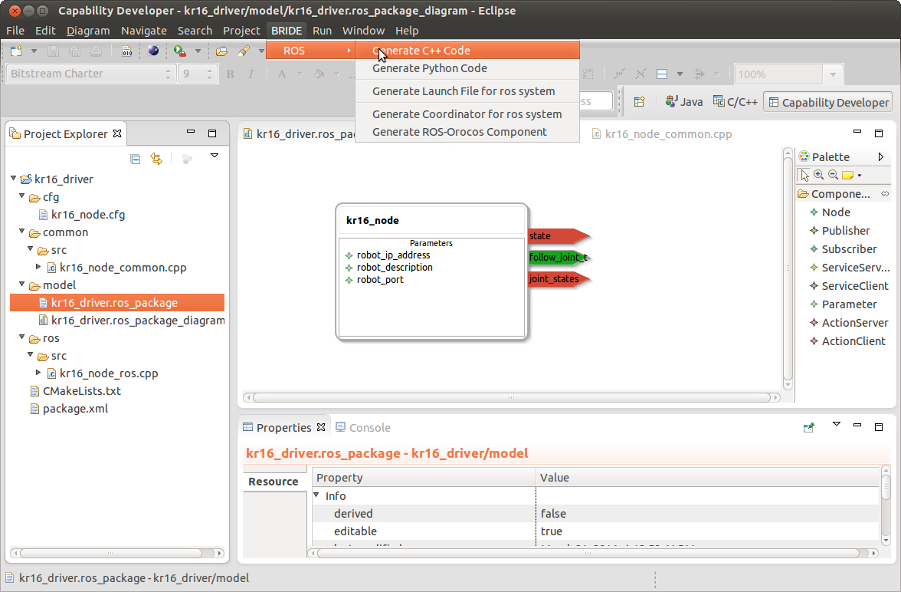

### 4.  Integrating the driver capabilities

To implement the actual capability code for your ROS driver you have to only focus on the kr16_node_common.cpp file in the common/src/ directory. You can open the file by double clicking it in the project explorer. The file contains protected regions you can use for your code that will not be overwritten once you regenerate the node by the tool chain.

Once the file is open you can now go to the kr16_node_impl class and edit the code as follows. Please be aware, that it is only save to edit the locations in between the user comments. All other edits will be overwritte by the next model generation process. At first we need to add the driver specific includes:

```
//ROS typedefs
#include "ros/ros.h"
#include <sensor_msgs/JointState.h>
#include <control_msgs/JointTrajectoryControllerState.h>

/* protected region user include files on begin */
//driver
#include <KukaEthernetClient/KukaEthernetClient.h>
#include <queue>
/* protected region user include files end */

```
Then we put the driver functionality into the user code sections of the "kr16_node_impl" class. The "configure()" function is called once, when the node is launched and should contain all intitialization code. The "update()" function is called for each iteration of the node and is used to publish the status information. The action callback function is called on request by the action client. 

```
class kr16_node_impl
{
	/* protected region user member variables on begin */
	KukaEthernetClient kuka_client_;
	bool kuka_callback_received_;
	int polling_rate_;
	int received_msg_id_;
	sensor_msgs::JointState joint_state_msg_;
	std::vector<std::string> joint_names_;
	/* protected region user member variables end */

public:
	kr16_node_impl()
	{
		/* protected region user constructor on begin */
		// Kuka Communication specifics
		polling_rate_ = 100;
		kuka_callback_received_ = false;
		received_msg_id_ = -1;
		/* protected region user constructor end */
	}

	void configure(kr16_node_config config)
	{
		/* protected region user configure on begin */
		bool dummy_mode = false;
		bool auto_connect = true;
		std::string xml_path = "/home/ros/catkin_ws/src/ipa325_kr16/ipa325_EkiDriver/common/files/EKIServerFrame.xml";
		kuka_client_.setClientDummy(dummy_mode);

		ROS_INFO("kr16_node_impl: Initializing KRC Ethernet Client");

		if (!kuka_client_.Initialize(xml_path, SocketAddress(config.robot_ip_address, config.robot_port), auto_connect))
		{
			int error = kuka_client_.getError();
			if ( error == 1)
			{
				ROS_ERROR("kr16_node_impl: Connection to KUKA KRC failed");
			}
			else if (error == 2)
			{
				ROS_ERROR("kr16_node_impl: Xml KRC definition file could not be parsed");
			}
			else if (error == 3)
			{
				ROS_ERROR("kr16_node_impl: Connection failed AND Xml KRC definition file could not be parsed");
			}
		}
		else
		{
			ROS_INFO("kr16_node_impl: Successfully connected to KUKA KRC");
		}

		boost::function<void (int)> fct( boost::bind( &kr16_node_impl::kukaCallback, this, _1 ) );
		kuka_client_.setCallbackFcn(fct);
		/* protected region user configure end */
	}

	void update(kr16_node_data &data, kr16_node_config config)
	{
		/* protected region user update on begin */
		data.out_joint_states = joint_state_msg_;
		/* protected region user update end */
	}

	void callback_follow_joint_trajectory_action_(const control_msgs::FollowJointTrajectoryGoalConstPtr &goal, actionlib::SimpleActionServer<control_msgs::FollowJointTrajectoryAction> *as_)
	{
		/* protected region user implementation of action callback for follow_joint_trajectory_action on begin */
		// helper variables
		ros::Rate r(polling_rate_);
		kuka_callback_received_ = false;

		std::queue<int> msg_queue;

		// TODO: Publish the feedback

		ROS_INFO("kr16_node_impl: FollowjointTrajectoryGoal received containing %i waypoints.", goal->trajectory.points.size()) ;

		for (u_int i = 0; i < goal->trajectory.points.size(); i++)
		{
			if (goal->trajectory.points[i].velocities.size() > 1)
			{
				ROS_WARN("kr16_node_impl: Only first velocity is accepted and defines all axes!");
			}
			float overall_velocity = goal->trajectory.points[i].velocities[0];

			int current_msg_id = kuka_client_.getMessageID();
			msg_queue.push(current_msg_id);

			kuka_client_.movePTP(current_msg_id,
					goal->trajectory.points[i].positions[0],
					goal->trajectory.points[i].positions[1],
					goal->trajectory.points[i].positions[2],
					goal->trajectory.points[i].positions[3],
					goal->trajectory.points[i].positions[4],
					goal->trajectory.points[i].positions[5],
					overall_velocity);
		}

		// waiti until execution of the action has finished
		while (!msg_queue.empty() && ros::ok() && !as_->isPreemptRequested())
		{
			if(kuka_callback_received_)
			{
				kuka_callback_received_ = false;
				// work through msgId-Queue;
				if(msg_queue.front() != received_msg_id_)
				{
					ROS_WARN("kr16_node_impl: QueueFront = %i; Recv = %i -> Indicating sync problem! Send Actions does not match responses by KRC", msg_queue.front(), received_msg_id_);
				}
				msg_queue.pop();
			}

			// TODO: publish the feedback
			//as_->publishFeedback(trajfeedback_);
			r.sleep();
		}

		if (as_->isPreemptRequested() || !ros::ok())
		{
			ROS_INFO("kr16_node_impl: : Preempted");
			// set the action state to preempted
			as_->setPreempted();
		}
		else
		{
			ROS_INFO("kr16_node_impl: : Succeeded");
			// set the action state to succeeded
			as_->setSucceeded();
		}
		/* protected region user implementation of action callback for follow_joint_trajectory_action end */

	}

	/* protected region user additional functions on begin */
	void kukaCallback(int msgID)
	{
		ROS_INFO("kr16_node_impl: KRC called back with MsgID %i done", msgID);

		received_msg_id_ = msgID;

		kuka_callback_received_ = true;
		ROS_INFO("kr16_node_impl: Kuka callback received");

		KukaAxis current_axis = kuka_client_.getCurrentAxis();

		//Setting joint state
		sensor_msgs::JointState joint_state_msg;
		joint_state_msg.header.stamp = ros::Time::now();
		joint_state_msg.name = joint_names_;
		joint_state_msg.position = current_axis.toStdVector();

		//robot_pose = kuka_client_.getCurrentFrame();
	}
	/* protected region user additional functions end */

};
```
You can now build the node by executing catkin_make in your catkin workspace on the console
```
cd /home/ros/catkin_ws
catkin_make
```
If you there are no errors: Congratulation you just created your first model-based ROS node.

### 5.  Create a corresponding node to execute motion commands

To create another node that can listen to the talker node you should create a new C++ Project as above and call it "kr16_test_client". Now again create a new folder "model" and a "New -> Other..." and then "ROS Package Diagram" from the BRIDE section. Name the new diagram kr16_test_client.ros_package_diagram" and the new model "kr16_test_client.ros_package". 

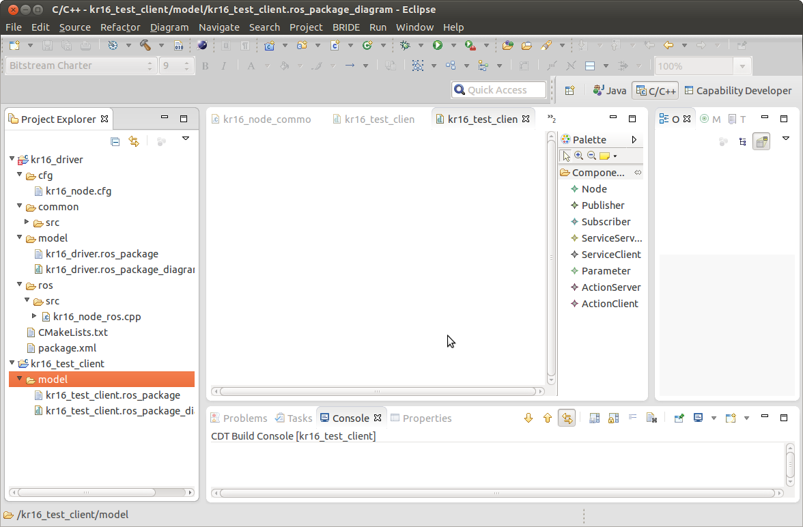

Now click on the white are of the daring panel and fill out the package property as follows: 

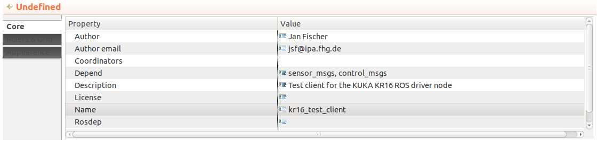

You can now add a action client named "follow_joint_trajectory_action", a subscriber named "state" and two parameters called "joint_poisition_1" and "joint_position_2" to the new node. 

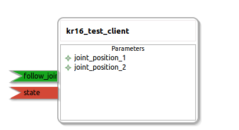

Edit their properties as follows:

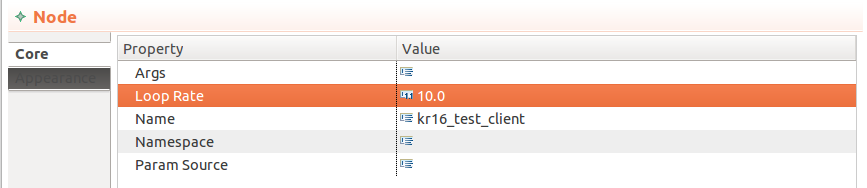
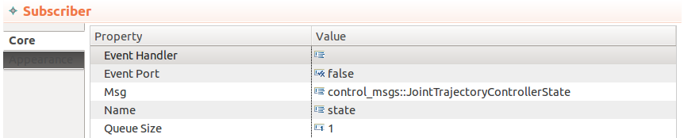
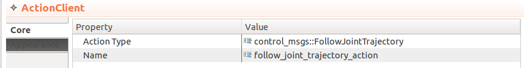
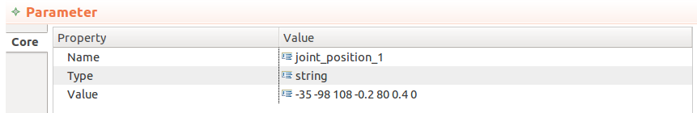


After generating the code out of the model you can alter the kr16_test_client_impl class of the common/src/kr16_test_client_common.cpp file as follows. At fist we need to insert some more include files to make ActionClients feasible (this won't be necessary in later BRIDE versions any more):
```
//ROS typedefs
#include "ros/ros.h"
#include <control_msgs/JointTrajectoryControllerState.h>

/* protected region user include files on begin */
#include <actionlib/client/simple_action_client.h>
#include <control_msgs/FollowJointTrajectoryAction.h>
/* protected region user include files end */
```

Now, we edit the "kr16_test_client_impl" class to trigger the kr16 driver node:

```
class kr16_test_client_impl
{
	/* protected region user member variables on begin */

	/* protected region user member variables end */

public:
	kr16_test_client_impl()
	{
		/* protected region user constructor on begin */

		/* protected region user constructor end */
	}
	void configure(kr16_test_client_config config)
	{
		/* protected region user configure on begin */
		/* protected region user configure end */
	}
	void update(kr16_test_client_data &data, kr16_test_client_config config)
	{
		/* protected region user update on begin */

		actionlib::SimpleActionClient<control_msgs::FollowJointTrajectoryAction> ac("follow_joint_trajectory_action", true);
		ROS_INFO("kr16_test_client_impl: Waiting for action server to start.");
		ac.waitForServer(); //will wait for infinite time

		// declaring goal of the action
		control_msgs::FollowJointTrajectoryGoal goal;
		// We will have two waypoints in this goal trajectory
		goal.trajectory.points.resize(2);

		int ind = 0;
		goal.trajectory.points[ind].positions.resize(7);
		goal.trajectory.points[ind].positions[0] = -35;
		goal.trajectory.points[ind].positions[1] = -98;
		goal.trajectory.points[ind].positions[2] = 108;
		goal.trajectory.points[ind].positions[3] = -0.2;
		goal.trajectory.points[ind].positions[4] = 80;
		goal.trajectory.points[ind].positions[5] = 0.4;
		goal.trajectory.points[ind].positions[6] = 0.0;
		// Velocities
		goal.trajectory.points[ind].velocities.resize(7);
		for (size_t j = 0; j < 7; ++j)
		{
			goal.trajectory.points[ind].velocities[j] = 10.0;
		}
		// To be reached 1 second after starting along the trajectory
		goal.trajectory.points[ind].time_from_start = ros::Duration(60.0);

		// Second trajectory point
		// Positions
		ind += 1;
		goal.trajectory.points[ind].positions.resize(7);
		goal.trajectory.points[ind].positions[0] = -25;
		goal.trajectory.points[ind].positions[1] = -95;
		goal.trajectory.points[ind].positions[2] = 105;
		goal.trajectory.points[ind].positions[3] = -0.5;
		goal.trajectory.points[ind].positions[4] = 80;
		goal.trajectory.points[ind].positions[5] = 10.5;
		goal.trajectory.points[ind].positions[6] = 0;
		// Velocities
		goal.trajectory.points[ind].velocities.resize(7);
		for (size_t j = 0; j < 7; ++j)
		{
			goal.trajectory.points[ind].velocities[j] = 10.0;
		}
		// To be reached 2 seconds after starting along the trajectory
		goal.trajectory.points[ind].time_from_start = ros::Duration(60.0);


		// ********************************//
		// sending of goal to actionserver //
		// ********************************//

		// send the goal to the action server
		ac.sendGoal(goal);
		ROS_INFO("kr16_test_client_impl: Sending trajectory to server");

		// ********************************//
		// waiting for reply by act-server //
		// ********************************//

		// wait for the action to return
		ROS_INFO("kr16_test_client_impl: Waiting for action to return");
		bool finished_before_timeout = ac.waitForResult(ros::Duration(60.0));

		// handling possible timeout of actionserver reply
		if (finished_before_timeout)
		{
			actionlib::SimpleClientGoalState state = ac.getState();
			ROS_WARN("kr16_test_client_impl: Action finished: %s",state.toString().c_str());
		}
		else
		{
			ROS_WARN("kr16_test_client_impl: Action did not finish before the time out.");
		}
		/* protected region user update end */

	}


	/* protected region user additional functions on begin */
	/* protected region user additional functions end */

};
```

Again, you can now build the node by executing catkin_make in your catkin workspace on the console
```
cd /home/ros/catkin_ws
catkin_make
```

Well done, our nodes are now ready to be deployed by the system model.

### 6.  Using the BRIDE system model for deployment

Create a new Eclipse project by "File -> New -> Project" and then "General -> Project". Give the project a name, e.g. "kr16_deployment" and finish the creation wizard. Afterwards you can create a new folder named "model" as when creating capability models.

Now you can create a new deployment model by right clicking on the model folder and selecting "New -> Other..." and then "ROS System diagram" (note the difference to "ROS Package Diagram") below the BRIDE folder. Now name the new model diagramm "kr16_deployment.ros_system_diagram" and then after clicking next name the model "kr16_deployment.ros_system". You should now see an empty ros_diagram editor. 

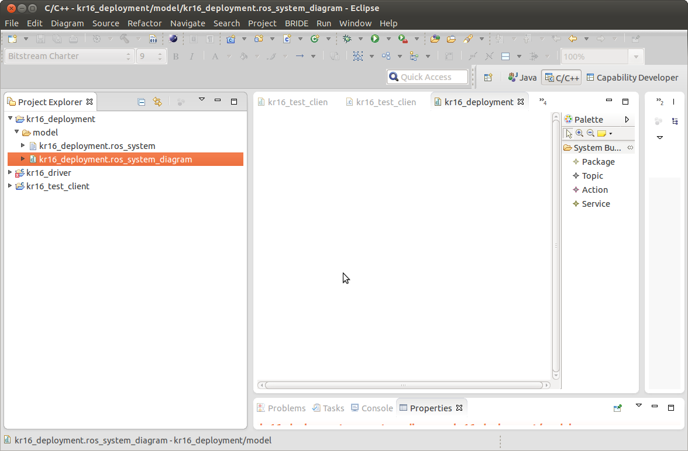

#### 6.1  Adding packages to the system model

To add capability models to your system you select the Package tool on the right and click on the white area of the ros system. You can now select the Capability and Coordinator models from the dialog (one only). Repeat the step until you have added the  kr16_driver and the kr16_test_client. The screenshot below shows BRIDE while adding the kr16_driver and the kr16_test_client. 

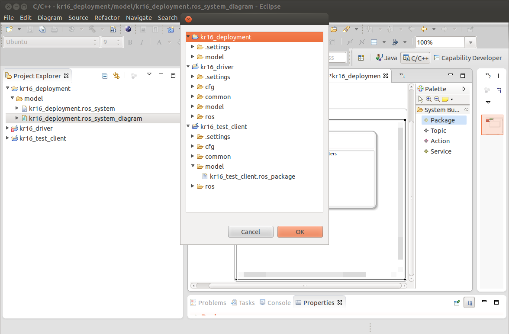

#### 6.2  Connecting actions, services and topics

In the system diagram you can now use the topic tool in the pallet to connect the Publishers with the corresponding Subscribers and name the topic. Similar you can connect the services and actions in the system. In this example we connect the "state" Publisher port of the kr16_driver with the "state" subscriber port of the kr16_test_client node. We name the topic "/arm_controller/state". From now on the topic will be show up in ROS under this name (e.g. when using "rostopic list" command).

Afterwards connect the action server and the action client and name the connection /arm_controller/follow_joint_trajectory_action. Your model should then look similar to this picture:

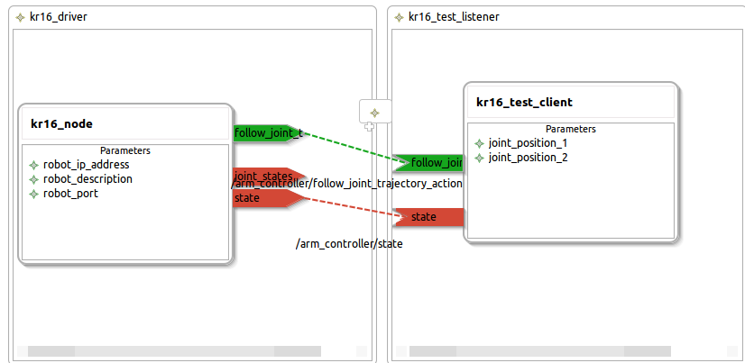

Finally, edit the package settings by clicking on the white area of the drawing pane and give the system model the name kr16_deployment

#### 6.2  Generating launch files and the manifest

After finishing the system configuration you can generate the manifest and launch file for the system package. You can do that in the BRIDE menu in ROS->"Generate Launch file for ros system". After refreshing your project explorer by right clicking the kr16_deployment package and pressing "Refresh" you should now see a "manifest.xml" that includes all dependencies and an "system.launch" file that configures and connects all nodes in the system. 

#### 6.3  Testing the system

When you open a new terminal you should be able to run
```
roslaunch kr16_deployment system.launch 
```
With the standard ros tools (e.g. rostopic, rxgraph, etc.) you should now be able to investigate your system. If so, you are ready to move on to the real robot!


