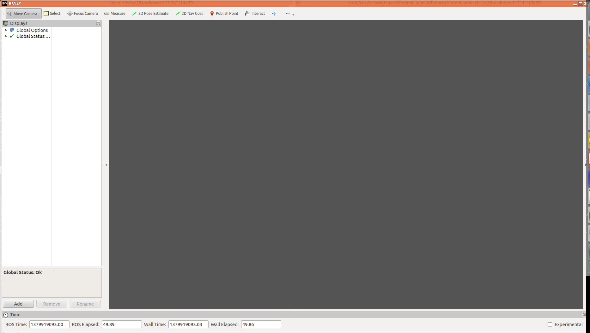
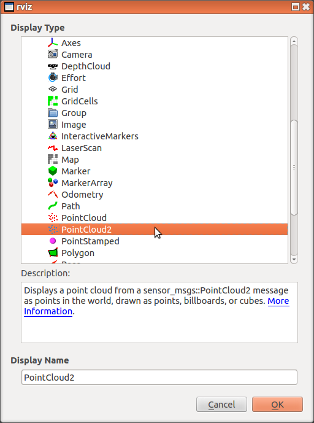
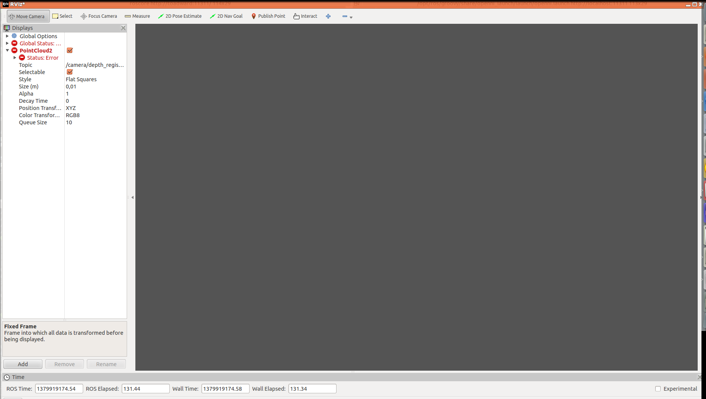
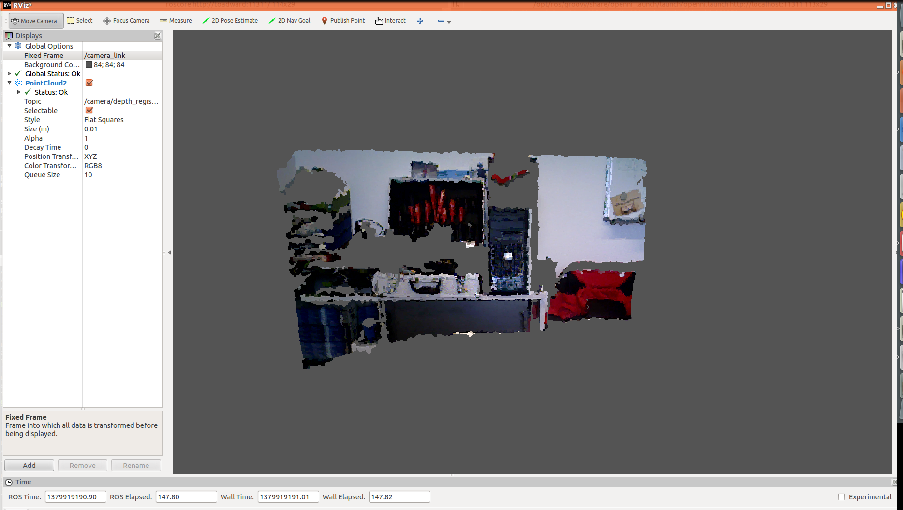
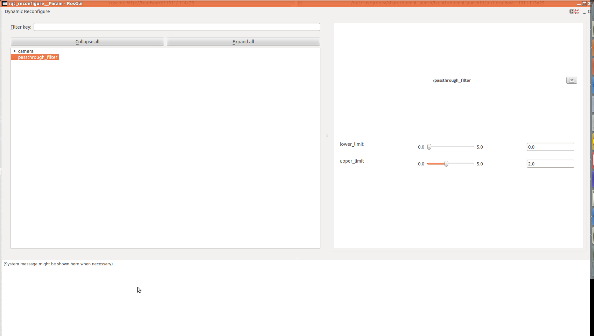
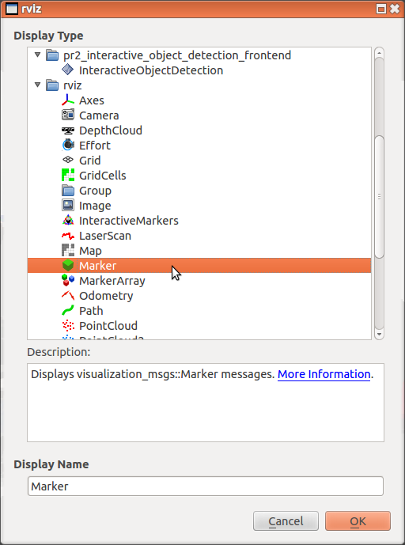
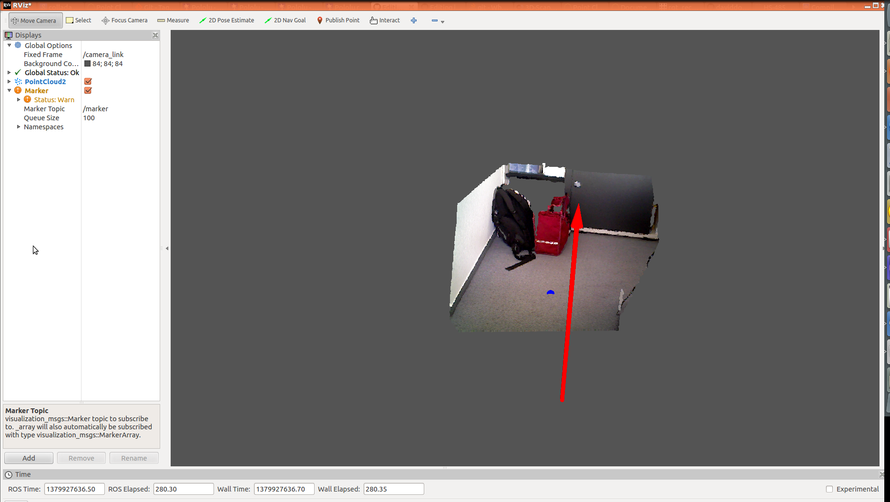

# 3D Perception with ROS and PCL
## Tutorial

The goal of this tutorial is to segment an obstacle on the ground floor using 3D perception algorithms. The necessary steps can be seen in the figure below:


### 1.  3D camera driver

In this tutorial an Asus XTion RGBD camera is used. The ROS driver is located in the package [openni_camera](http://www.ros.org/wiki/openni_camera) and the launch files in [openni_launch](http://www.ros.org/wiki/openni_launch).

#### 1.1.  Run the driver

To start the driver, run in a new terminal
```
roslaunch openni_launch openni.launch
```
To see the output topics, type
```
rostopic list
```
You should see a lot of topics starting with /camera/.

#### 1.2.  Visualize the camera data in RVIZ

To open rviz, run
```
rosrun rviz rviz -d plain.rviz
```


Click on "Add" and select "PointCloud2":



In "Displays->PointCloud2", select the topic "/camera/depth_registered/points". You will probably see no point cloud but an error message:



In order to visualize correctly, you have to choose the reference coordinate frame. In "Global Options", set "Fixed Frame" to "/camera_link". Now you can see the sensor data:



Now you can change the visualization options, such as "Style", "Size", "Alpha" and "Color Transform" in order to alter the visualization appearance.

#### 1.3.  PointCloud2 message

The message definition is in the package [sensor_msgs](http://wiki.ros.org/sensor_msgs).

```
# This message holds a collection of N-dimensional points, which may
# contain additional information such as normals, intensity, etc. The
# point data is stored as a binary blob, its layout described by the
# contents of the "fields" array.

# The point cloud data may be organized 2d (image-like) or 1d
# (unordered). Point clouds organized as 2d images may be produced by
# camera depth sensors such as stereo or time-of-flight.

# Time of sensor data acquisition, and the coordinate frame ID (for 3d
# points).
Header header

# 2D structure of the point cloud. If the cloud is unordered, height is
# 1 and width is the length of the point cloud.
uint32 height
uint32 width

# Describes the channels and their layout in the binary data blob.
PointField[] fields

bool    is_bigendian # Is this data bigendian?
uint32  point_step   # Length of a point in bytes
uint32  row_step     # Length of a row in bytes
uint8[] data         # Actual point data, size is (row_step*height)

bool is_dense        # True if there are no invalid points
```

### 2.  Passthrough filter

Now we add a passthrough filter in order to crop the wall in the background of the point cloud. This step will enhance the following processing step.
Additional information is available [here](http://pointclouds.org/documentation/tutorials/passthrough.php#passthrough).

#### 2.1.  Run the filter

Go to the pcl_tutorial package
```
roscd pcl_tutorial
```
and check the launch file
```
gedit launch/passthrough_filter.launch
```
You can observe, that the line <remap from="point_cloud_in" to="/camera/depth_registered/points"/> remaps the input topic to the colored point cloud of the openni node. Also, you can see the default values for the parameters. Use the command
```
roslaunch pcl_tutorial passthrough_filter.launch
```
to run the filter. In RVIZ, you can add a second PointCloud2 display and set the topic name to "/passthrough_filter/point_cloud_out".
Now you can see how the filter works.

#### 2.2.  Configure parameters

Now we configure the parameters of the passthrough filter using [dynamic reconfigure](http://wiki.ros.org/rqt_reconfigure). Type
```
rosrun rqt_reconfigure rqt_reconfigure
```
to open the GUI. Select "passthrough_filter". Now you can change the upper and lower limit of the filter. The parameters specify limits of the depth values. 
Adjust the parameters so that the wall in the background does not appear anymore.



### 3.  Plane segmentation

#### 3.1.  Run the segmentation

The next step is to start the plane segmentation. The algorithm uses [RANSAC](http://pointclouds.org/documentation/tutorials/random_sample_consensus.php#random-sample-consensus) to fit a plane model to the point cloud. It always
finds the dominant plane regardless how the scene looks. Type
```
roslaunch pcl_tutorial plane_segmentation.launch
```
in a new terminal. The node will output markers for the centroid, the normal and the surface of the plane.
It will also output the inliers of the plane (/plane_segmentation/plane) and the remainder of the scene (/plane_segmentation/above_plane) as point cloud.
Use RVIZ to observe an compare the two output point clouds.

#### 3.2. Visualize the marker

In RVIZ, click on "Add" and select "Marker":



Change the marker topic to "/plane_segmentation/marker_plane". You should see a rectangle for the plane now.
You can also show the plane parameters (normal, centroid) by add a second marker display and subscribing to "/plane_segmentation/marker_params":



Now you can move the camera and take a look on the results in RVIZ. Keep in mind that the algorithm always segments the dominant plane

#### 3.3.  Marker message

The Marker message is defined in the package [visualization_msgs](http://wiki.ros.org/visualization_msgs). More information
about marker types can be found [here](http://wiki.ros.org/rviz/DisplayTypes/Marker).

```
# See http://www.ros.org/wiki/rviz/DisplayTypes/Marker and http://www.ros.org/wiki/rviz/Tutorials/Markers%3A%20Basic%20Shapes for more information on using this message with rviz

uint8 ARROW=0
uint8 CUBE=1
uint8 SPHERE=2
uint8 CYLINDER=3
uint8 LINE_STRIP=4
uint8 LINE_LIST=5
uint8 CUBE_LIST=6
uint8 SPHERE_LIST=7
uint8 POINTS=8
uint8 TEXT_VIEW_FACING=9
uint8 MESH_RESOURCE=10
uint8 TRIANGLE_LIST=11

uint8 ADD=0
uint8 MODIFY=0
uint8 DELETE=2

Header header                        # header for time/frame information
string ns                            # Namespace to place this object in... used in conjunction with id to create a unique name for the object
int32 id                           # object ID useful in conjunction with the namespace for manipulating and deleting the object later
int32 type                         # Type of object
int32 action                         # 0 add/modify an object, 1 (deprecated), 2 deletes an object
geometry_msgs/Pose pose                 # Pose of the object
geometry_msgs/Vector3 scale             # Scale of the object 1,1,1 means default (usually 1 meter square)
std_msgs/ColorRGBA color             # Color [0.0-1.0]
duration lifetime                    # How long the object should last before being automatically deleted.  0 means forever
bool frame_locked                    # If this marker should be frame-locked, i.e. retransformed into its frame every timestep

#Only used if the type specified has some use for them (eg. POINTS, LINE_STRIP, ...)
geometry_msgs/Point[] points
#Only used if the type specified has some use for them (eg. POINTS, LINE_STRIP, ...)
#number of colors must either be 0 or equal to the number of points
#NOTE: alpha is not yet used
std_msgs/ColorRGBA[] colors

# NOTE: only used for text markers
string text

# NOTE: only used for MESH_RESOURCE markers
string mesh_resource
bool mesh_use_embedded_materials

```

#### 3.4.  Configure parameters

There are two parameters you can modify using dynamic reconfigure. "dist_thresh" specifies, at which ditance from the plane 
model a point is still considered an inlier. Adjust it until the plane is segmented correctly (i.e. only points actually belonging
to the ground floor are part of the plane). The parameter "max_iterations" improves the segmentation robustness but lowers computation speed if increased.

### 4.  Voxel filter (optional)

In the terminal for the plane segmentation, you can see the processing time which is quite long. In order to speed up the computation we are going to add a voxel filter as pre-processing step.
The resulting processing chain can be seen in the figure below:


Additional information on the voxel grid can be found [here](http://pointclouds.org/documentation/tutorials/voxel_grid.php#voxelgrid).

#### 4.1. Configure the launch files

The voxel filter should be added as a first processing step. Thus, you have to modify the launch file for the passthrough filter so that it is connected to the output of the voxel filter. Type
```
roscd pcl_tutorial
```
Now open the file "launch/passthrough_filter.launch" and change the remap of "point_cloud_in" to "/voxel_filter/point_cloud_out".

#### 4.2. Run the voxel filter

Now you can run the filter node by
```
roslaunch pcl_tutorial voxel_filter.launch
```
You also have to restart the passthrough_filter because the launch file was modified.
You can change the leaf size parameter of the node using dynamic reconfigure. The higher the leaf size is, the lower is the resolution of the filter output. 

#### 4.3. Check the results

In console, observe the computation time of the plane segmentation if you change the parameters of the voxel filter.
Also, visualize the downsampled point cloud (/voxel_filter/point_cloud_out) in RVIZ.
